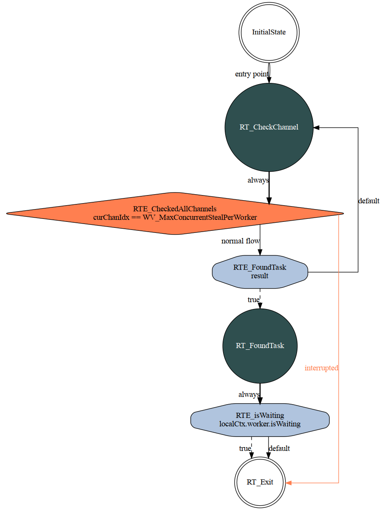
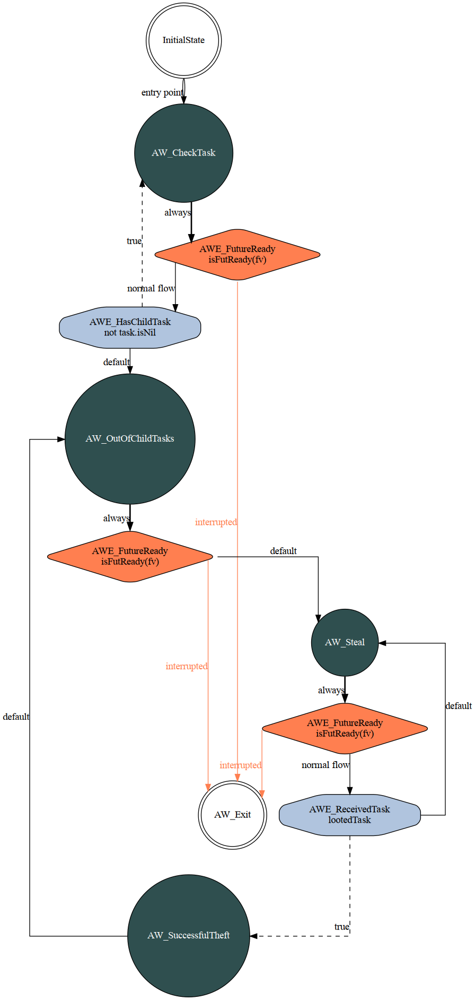
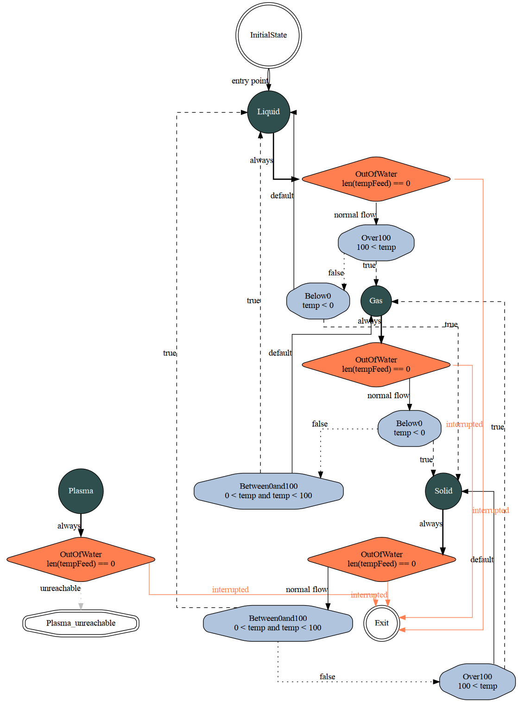

# Synthesis
[](https://travis-ci.com/mratsim/Synthesis)
[](https://dev.azure.com/numforge/Synthesis/_build/latest?definitionId=1&branchName=master)

[](https://opensource.org/licenses/Apache-2.0)
[](https://opensource.org/licenses/MIT)


## Overview

This package exports a set of macros to synthesize static procedure-based automata from
a declarative description of states, triggers and transitions
with all states, triggers and transitions known at compile-time.

It is fast, composable, threadsafe, generates compact code and does not allocate on the heap.

Within each states you also have the full power
of the Nim language instead of being restricted to only operations
supported by a custom domain-specific language.

The generated state machine is a procedure, with parameters of your choosing that access in your states.
You can easily call other procedures to build nested state machines or
introduce a stack of past states to create a pushdown automata (for parsing Brainfuck or JSON for example).

A detailed usage tutorial is available at [examples/water_phase_transitions.nim](). It is executable.

This is a support library for the [Weave](https://github.com/mratsim/weave) multithreading runtime.
Requirements for a multithreading runtime makes Synthesis also an excellent fit
to generate state machines for embedded devices, protocols
and managing complex event-driven workloads in general.

## Appetizers

Here are 2 simple examples of the usage of Synthesis in production code to implement components of the Weave multithreading runtime.

### Worker state machine

[Source](https://github.com/mratsim/weave/blob/4493b493/weave/work_fsm.nim)

This is the description of the transitions of a worker thread that ran out of tasks in its own task queue
and checks if it managed to steal tasks from other threads. (The theft is handled in another state machine.)

```Nim
type
  RecvTaskState = enum
    RT_CheckChannel
    RT_FoundTask

  RT_Event = enum
    RTE_CheckedAllChannels
    RTE_FoundTask
    RTE_isWaiting
```



### sync (await) a task that may be spawned on another thread

[Source](https://github.com/mratsim/weave/blob/4493b493/weave/await_fsm.nim)

This is the description of the transitions of any thread that syncs (awaits) a future that may be handled in another thread.

In summary, while the awaited task has child tasks still pending in this worker thread, those are processed in priority,
otherwise, it steals tasks from other threads to help them on their workload.
As soon as the future is ready, it exits.

```Nim
type AwaitState = enum
  AW_CheckTask
  AW_OutOfChildTasks
  AW_Steal
  AW_SuccessfulTheft

type AwaitEvent = enum
  AWE_FutureReady
  AWE_HasChildTask
  AWE_ReceivedTask
```



## Table of Contents

- [Synthesis](#synthesis)
  - [Overview](#overview)
  - [Appetizers](#appetizers)
    - [Worker state machine](#worker-state-machine)
    - [sync (await) a task that may be spawned on another thread](#sync-await-a-task-that-may-be-spawned-on-another-thread)
  - [Table of Contents](#table-of-contents)
  - [Commented example: Water phases](#commented-example-water-phases)
  - [Displaying the state machine](#displaying-the-state-machine)
  - [Technical constraints](#technical-constraints)
  - [References](#references)

## Commented example: Water phases
```Nim
type Phase = enum
  ## States of your automaton.
  ## The terminal state does not need to be defined
  Solid
  Liquid
  Gas
  Plasma # Plasma is almost unused

type Event = enum
  ## Named events. They will be associated with a boolean expression.
  Over100
  Between0and100
  Below0
  OutOfWater

# Common configuration
# -------------------------------------------

# Create a "waterMachine" entry.
declareAutomaton(waterMachine, Phase, Event)

# Optionally setup the "prologue". Extra state goes there, the variables are visible by all.
setPrologue(waterMachine):
  echo "Welcome to the Steamy machine version 2000!\n"
  var temp: float64

# Mandatory initial state. This must be one of the valid state of the state enum ("Phase" in our case)
setInitialState(waterMachine, Liquid)

# Terminal state is mandatory. It's a pseudo state and does not have to be part of the state enum.
setTerminalState(waterMachine, Exit)

# Optionally setup the "epilogue". Cleaning up what was setup in the prologue goes there.
setEpilogue(waterMachine):
  echo "Now I need some coffee."

# Events
# -------------------------------------------

implEvent(waterMachine, OutOfWater):
  tempFeed.len == 0

implEvent(waterMachine, Between0and100):
  0 < temp and temp < 100

implEvent(waterMachine, Below0):
  temp < 0

implEvent(waterMachine, Over100):
  100 < temp

# `onEntry` and `onExit` hooks
# -------------------------------------------
#
# Those are applied on each state entry, before conditions are checked
# and on each state exits. The only exceptions are "interrupt" behaviours.

onEntry(waterMachine, [Solid, Liquid, Gas]):
  let oldTemp = temp
  temp = tempFeed.pop()
  echo "Temperature: ", temp

# `behaviors`
# -------------------------------------------
#
# Interrupts are special triggers which ignores onEntry/onExit
#
# They allow the normal operations to make assumptions like
# a container not being empty or a value being available.
#
# They are also suitable to handle termination signals.

behavior(waterMachine):
  ini: [Solid, Liquid, Gas, Plasma]
  fin: Exit
  interrupt: OutOfWater
  transition:
    echo "Running out of steam ..."

# Conditional state change, depending on temperature.
behavior(waterMachine):
  ini: Solid
  fin: Liquid
  event: Between0and100
  transition:
    assert 0 <= temp and temp <= 100
    echo "Ice is melting into Water.\n"

behavior(waterMachine):
  ini: Liquid
  fin: Gas
  event: Over100
  transition:
    assert temp >= 100
    echo "Water is vaporizing into Vapor.\n"

#...

# Steady state, if no phase change was triggered, we stay in our current phase
behavior(waterMachine):
  steady: [Solid, Liquid, Gas]
  transition:
    # Note how we use the oldTemp that was declared in `onEntry`
    echo "Changing temperature from ", oldTemp, " to ", temp, " didn't change phase. How exciting!\n"

# `Synthesize`
# -------------------------------------------
# Synthesizing the automaton will transform the previous specification
# into a concrete procedure with a name, type and inputs of your choosing.
#
# Assertions are inserted to ensure the automaton
# stops if a state+event combination was not handled.
#
# You can pass "-d:debugSynthesis" to view the state machine generated
# at compile-time.
#
# The generated code can also be copy-pasted for debugging or for further refining.
synthesize(waterMachine):
  proc observeWater(tempFeed: var seq[float])

# Running the machine
# -------------------------------------------
import random, sequtils

echo "\n"
# Create 20 random temperature observations.
var obs = newSeqWith(20, rand(-50.0..150.0))
echo obs
echo "\n"
observeWater(obs)

# Output
# -------------------------------------------
# @[-3.460770047808822, 114.5693402308219, 16.66758940395412, 147.8992369379481, 38.74529893378966, -34.83679531473696, 68.73127270016445, -10.89306136942781, 55.17781700115015, 114.8825749296374, 86.88038583504948, 47.98729291960338, -40.94605405014646, 141.4807806383724, -19.78255259056119, -1.654260475969281, 37.0554825533913, 80.74588296425821, -7.707680239048244, 37.63170603752019]

# Welcome to the Steamy machine version 2000!
#
# Temperature: 37.63170603752019
# Changing temperature from 0.0 to 37.63170603752019 didn't change phase. How exciting!
#
# Temperature: -7.707680239048244
# Water is freezing into Ice.
#
# Temperature: 80.74588296425821
# Ice is melting into Water.
#
# Temperature: 37.0554825533913
# Changing temperature from 80.74588296425821 to 37.0554825533913 didn't change phase. How exciting!
#
# Temperature: -1.654260475969281
# Water is freezing into Ice.
#
# Temperature: -19.78255259056119
# Changing temperature from -1.654260475969281 to -19.78255259056119 didn't change phase. How exciting!
#
# Temperature: 141.4807806383724
# Ice is sublimating into Vapor.
# ...
```

## Displaying the state machine

It is possible to display the finite state machine using Graphviz.
Synthesis representation can be converted to Graphviz ".dot" (or ".gv") with `toGraphviz`

Using the previous `waterMachine`
```Nim
const dotRepr = toGraphviz(waterMachine)
writeFile("water_phase_transitions.dot", dotRepr)
```

Note: The conversion is done at compile-time and stored in a string.

To convert the graph described in the graphviz file to a `.png` use the following command (assuming a shell and graphviz package being installed)
```sh
dot -Tpng water_phase_transitions.dot -o water_phase_transitions.png
```
For SVG
```sh
dot -Tsvg water_phase_transitions.dot -o water_phase_transitions.svg
```

A default style is used to differentiate between states, interrupts (exceptional events) and regular events/triggers.


Output of the waterMachine



Alternative to Graphviz can be used on the `.dot` files if the output is unsatisfactory. Remember that graph node placement is usually an NP-complete task and requires heuristics to be solved that may not be optimal for your specific graph. In that case consider splitting your finite state machine hence building hierarchical state machines.

## Technical constraints

The state machine is used as the core of a multithreading runtime:
- Threading friendly:
  - No GC or memory management on the heap

- Visual debugging via printing the graph to ensure that all events are handled
  and no state leads to an unreachable code path.

- Easy to map to model checking and formal verification via clearly labeled: states, events, transitions.

  Multithreading is complex and the more we can prove properties (like the absence of deadlocks or livelocks)
  the more confidence we can have in the runtime.

- Extremely fast and very low CPU-overhead, as overhead in the state machine means more latency in scheduling work. Furthermore, slowness effects are "scaled" by the number of cores.

- Extensibility: as runtime requirements grow (distributed clusters, heterogeneous computing, fine-grained barriers, IO, continuations, cancellations,...),

  Synthesis should help minimizing the potential for entangled control-flow
  and missing edge-cases.

Synthesis generates a procedure-based automaton using gotos for transitions:
  - This avoids function calls/returns and associated pushing/poping stack overhead
  - and switch dispatch branch prediction miss due to having a single point of dispatch..

In addition to the multithreading runtime requirements this architecture
allow Synthesis to produce code with a very low footprint which makes it suitable for embedded.
Furthermore, setPrologue/setEpilogue/onEntry/onExit and the transitions are very flexible, they can
use inline statements, declare new variables or defer computation to one or more procs.

## References
- [Mealy State Machine](https://en.wikipedia.org/wiki/Mealy_machine)
- [Pushdown Automaton](https://en.wikipedia.org/wiki/Pushdown_automaton)
- [Communicating Finite State Machines](https://en.wikipedia.org/wiki/Communicating_finite-state_machine)
- [Petri Nets](https://en.wikipedia.org/wiki/Petri_net)
- [Kahn Process Networks](https://en.wikipedia.org/wiki/Kahn_process_networks)

Extras
- [Overview/Slides from Marquette Embedded SystemS Laboratory](https://www.dejazzer.com/ece777/ECE777_3_system_modeling.pptx)
- [Berkeley's Ptolemy project](https://ptolemy.berkeley.edu/index.htm)
